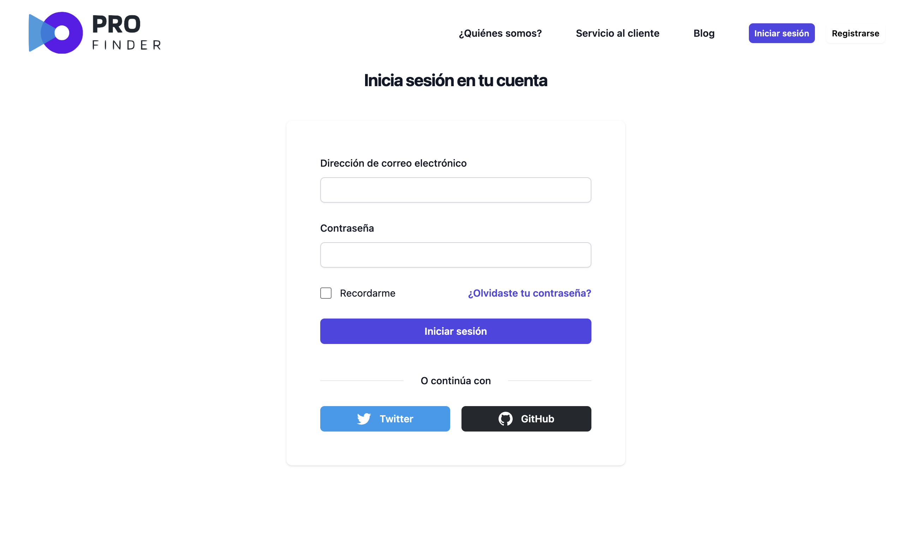
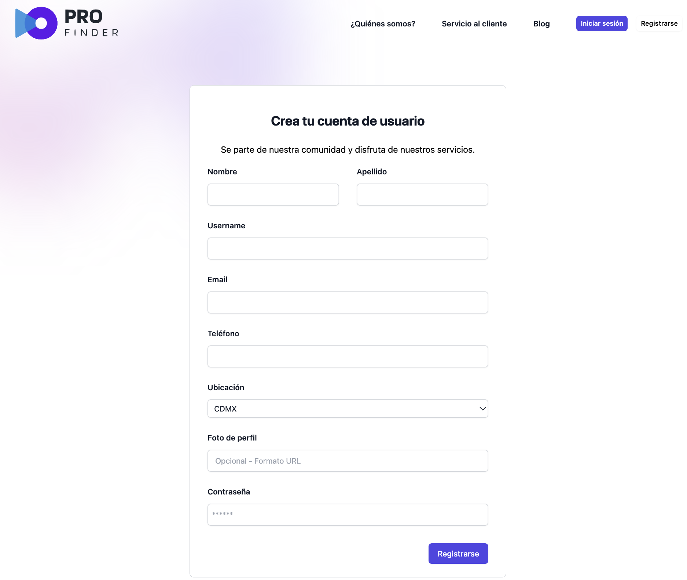
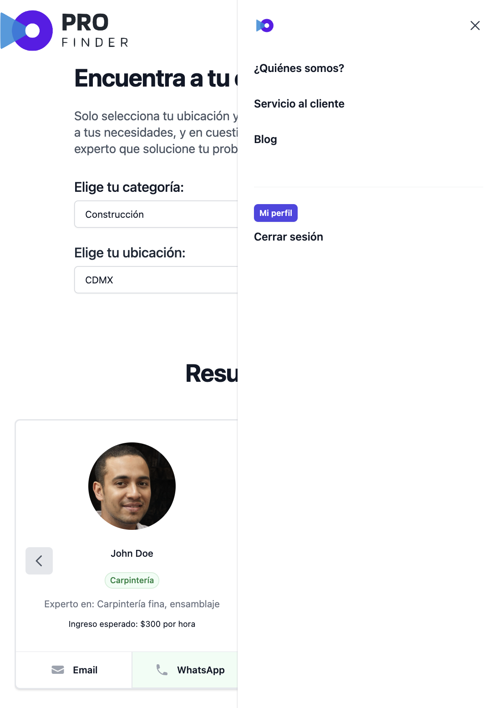

# Profinder 👤

## Table of Contents
- [Description](#description)
- [Installation](#installation)
- [Usage](#usage)
- [Features](#features)

## Description
Profinder application was created with the aim of helping people find someone who can solve their problems. To access the private data of our staff and use the application, it is necessary to log in. 

- Motivation 💪🏻
The motivation behind this project was to provide a platform where people can find help quickly and efficiently. Often, we are faced with problems for which we don't have the solution and the idea of having a place where we can search for experts in different fields and contact them directly seemed very useful.

- Problem it solves ⚙️
People Finder solves the problem of finding someone suitable to solve a specific problem. It can be difficult and time consuming to search for the right person with the expertise needed to solve a particular problem. This application simplifies that process by providing a directory of people with varied skills and knowledge who are willing to help.

- What we have learned 💡
In developing this project, we have learned about designing user interfaces, implementing secure login systems, and managing private data. We have also gained experience in database management and creating efficient search algorithms.

## Installation
Follow these steps to install and run the project in your development environment:

- Clone the repository from GitHub: git clone git@github.com:AndyAnza/profinder.git  
- Access the project directory: cd profinder
- Install the dependencies: npm install
- Run the seeds: npm run seed
- Start the application: npm run develop
- Open your web browser and access the URL: http://localhost:5173

## Usage
Once you have installed and run the application, follow these steps to use it:

- Open the deployed link and that´s all: http://.........
- Prove our application.
- Create your new account  
- You can search, become a professional, update your information.
or... 

- Open your web browser and access the URL: http://localhost:5173
- On the home page, log in with your account.
- Once logged in, you will be able to search for people using keywords related to your problem.
- Browse the search results and click on profiles to see more details about each person.
- If you find someone suitable to solve your problem, use the contact information provided to get in touch with that person.

## Features
- Advanced people search by keywords.
- Detailed profiles of people with relevant information.
- Contact information to communicate with the people found.
- Secure login system to access private personnel data.

